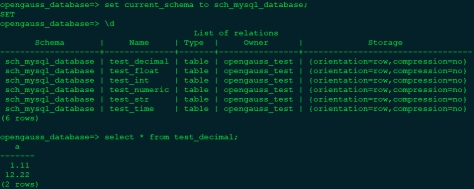
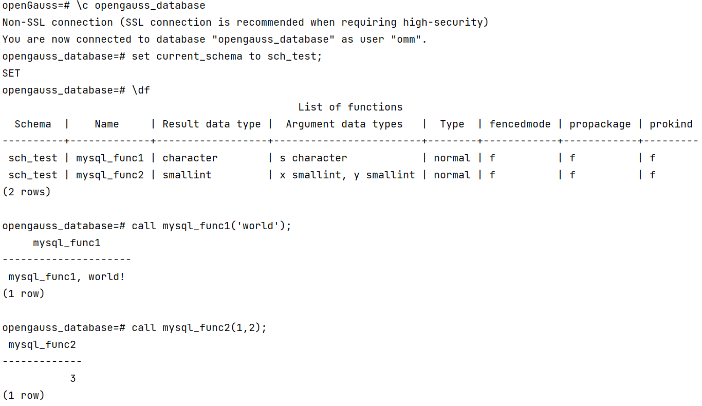
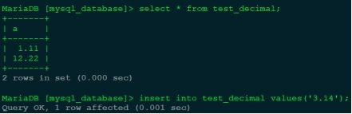
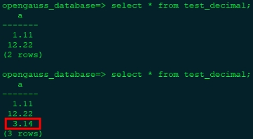

目录

[Toc]

# **1.** 概述

## **1.1.** 目的

本文旨在指导如何安装、使用chameleon工具完成从MySQL数据库迁移到openGauss。

## **1.2.** chameleon介绍

chameleon是一个用Python 3编写的MySQL到openGauss的实时复制工具。该工具提供了全量数据、对象的复制以及增量数据和DDL在线复制的功能。全量数据复制采用多表并行复制，支持两种方式：
(1) 从MySQL库查询数据导入openGauss; (2) 从指定CSV文件导入特定的表数据。全量对象支持表、约束、索引、外键、视图、函数、触发器、存储过程、触发器等对象的复制。增量复制通过开源三
方件mysql-replication解析MySQL的binlog，并构造DML和DDL语句，按照事务粒度并行导入至openGauss。

## **1.3.** 注意事项

### 1.3.1. 一般性限制

- 根据mysql-replication的要求，Python 3仅支持3.5~3.7。
- detach_replica过程将重置openGauss中的序列(serial)，以使数据库独立工作。同时外键约束也会在该过程中被创建和验证。
- 视图、自定义函数、存储过程、触发器支持离线迁移，不支持在线迁移。
- 自定义type不支持离线和在线迁移。
- 对于分区表，openGauss无法支持的分区表类型暂不会被迁移。分区表迁移规则见[分区表迁移规则](#_分区表迁移规则)。
- 配置文件中，schema mappings中指定的openGauss侧的目的schema名称不能是sch_chameleon。sch_chameleon是工具将自行创建用于辅助复制的schema名称。
- 列默认值问题。由于列的默认值可以是表达式，部分MySQL的表达式若openGauss不支持的话，离线迁移过程中会报错，导致迁移失败。可通过关闭迁移默认值的方式临时规避该问题。
- 工具支持的MySQL版本为 5.5+，openGauss的版本为 2.1.0+。
- 为保证大小写一致，迁移时需保证MySQL的大小写参数lower_case_table_names和openGauss的大小写参数dolphin.lower_case_table_names保持一致。
- 迁移后的索引或者约束如index_name会改写为index_name_table_name的带有表名信息的格式。
- MySQL端的fulltext索引，openGauss仅是语法兼容，因此迁移后本质仍为gin索引；MySQL端的hash索引，系统表information_schema.statistics显示为btree索引，因此迁移后仍为btree索引；MySQL端的spatial索引，openGauss端不支持，因此迁移过程提示告警信息，将忽略spatial索引，不进行迁移。
- 由于openGauss内核中哈希分区表不支持切割分区，不支持合成分区，不支持添加和删除分区。列表分区表不支持切割分区，不支持合成分区，故该工具在HASH/LIST分区暂不支持COALESCE和REORGANIZE，在HASH分区不支持ADD/DROP PARTITION。
- 由于目前openGauss内核的限制，二级分区的分区表可以正常执行 ALTER PARTITION中的ADD/DROP/TRUNCATE功能，COALESCE/REORGANIZE/EXCHANGE暂不支持。
- 对于HASH分区及KEY分区表在线迁移，由于MySQL和openGauss中hash分区内核实现不同，迁移后openGauss数据存放分区与MySQL中数据存放的分区存在差异。
- 对于二级分区表，openGauss不支持一级和二级分区采用相同的键值。
- 对于drop table操作，当表含有关联对象时，例如视图，mysql端可以用drop table只删除表而保留视图，openGauss端用drop table仅删除表会失败，此问题属于内核兼容性问题。因此对于mysql端的drop table语句，openGauss端将采用drop table cascade一并删除表及其关联的对象。
- mysql的ddl里面comment包含"\0"时，迁移到openGauss端会转换为"\x00" 
- 支持索引和表数据单独迁移，并且支持迁移过程中出现异常重启后跳过已经迁移完成的表。异常重启后索引和表数据是否分离需要与上一次迁移保持一致，直到所有表迁移完成。
- 由于部分参数功能存在冲突，在设置参数值时有一定限制，keep_existing_schema参数设置为True或者Yes时，is_create_index需设置为True或Yes, is_skip_completed_tables需设置为False或No。

### 1.3.2. 对象迁移限制

- 由于内核兼容性在持续增强，对象迁移采用先透传再翻译的原则进行，即先直接透传对象创建语句在openGauss端执行，若执行失败，再通过
[openGauss-tools-sql-translator](https://gitee.com/opengauss/openGauss-tools-sql-translator)进行翻译。
- 迁移的数据库对象体内若存在commit或rollback，将通过sql-translator翻译失败。
- MySQL存储过程中的NO SQL、READS SQL DATA、MODIFIES SQL字段和自定义函数中的CONTAINS SQL、NO SQL、READS SQL DATA、MODIFIES SQL DATA、SECURITY字段无法解析，
将通过sql-translator翻译失败。
- sql-translator借助开源三方件druid进行翻译，更多翻译情况请前往[openGauss-tools-sql-translator](https://gitee.com/opengauss/openGauss-tools-sql-translator)仓库。
- 对象迁移前需创建和MySQL对象所属definer同名的用户

例如MySQL中view1所属的definer=\`mysql_test\`@\`%\`，则在迁移前需在openGauss端创建与definer同名的用户\`mysql_test\`@\`%\`，并赋予一定的权限
(至少对迁移后对象所处的schema要有创建权限)，否则将导致对象迁移失败，报错原因为：

`role "mysql_test@%" does not exist`

或者

`permission denied for schema xxx`

MySQL端对象示例：

```
mysql> show create view view1;
+-------+-----------------------------------------------------------------------------------------------------------------------------+----------------------+----------------------+
| View  | Create View                                                                                                                 | character_set_client | collation_connection |
+-------+-----------------------------------------------------------------------------------------------------------------------------+----------------------+----------------------+
| view1 | CREATE ALGORITHM=UNDEFINED DEFINER=`mysql_test`@`%` SQL SECURITY DEFINER VIEW `view1` AS select `t1`.`aa` AS `aa` from `t1` | utf8                 | utf8_general_ci      |
+-------+-----------------------------------------------------------------------------------------------------------------------------+----------------------+----------------------+
1 row in set (0.00 sec)
```

迁移前openGauss创建与对象definer同名的用户，并赋予一定的权限

```
set b_compatibility_user_host_auth to on;
create user `mysql_test`@`%` with password 'Sample@123';
grant all privileges to `mysql_test`@`%`;
```

### 1.3.3. 在线迁移限制

在线DDL仅支持部分语句，主要包括 CREATE/DROP/RENAME/TRUNCATE TABLE, ALTER TABLE DROP/ADD/CHANGE/MODIFY, DROP PRIMARY KEY, CREATE/DROP INDEX, ALTER TABLE ADD FOREIGN KEY/UNIQUE INDEX/INDEX, ALTER TABLE DROP FOREIGN KEY/INDEX/CONSTRAINT, ALTER TABLE ADD/DROP/TRUNCATE/COALESCE/EXCHANGE/REORGANIZE PARTITION。

#### **1.3.3.1.** 添加/删除字段

ALTER TABLE {table_name} ADD/DROP

#### **1.3.3.2.** 修改字段数据类型、名称

ALTER TABLE {table_name} CHANGE/MODIFY

#### **1.3.3.3.** 删除主键约束

ALTER TABLE {table_name} DROP PRIMARY KEY

#### **1.3.3.4.** 删除表

DROP TABLE

#### **1.3.3.5.** 重命名表

RENAME TABLE

#### **1.3.3.6.** 截断表

TRUNCATE TABLE

#### **1.3.3.7.** 创建表

CREATE TABLE

#### **1.3.3.8.** 在线创建索引

1.CREATE [UNIQUE] INDEX index_name [index_type] ON tbl_name (key_part,...) [index_option]

2.ALTER TABLE  ADD {INDEX | KEY} [index_name] [index_type] (key_part,...) [index_option] 

index_type: USING {BTREE | HASH}
key_part: {col_name [(length)] | (expr)} [ASC | DESC]
index_option: {index_type | COMMENT 'string'}

#### **1.3.3.9.** 在线删除索引

1.DROP INDEX index_name ON tbl_name

2.ALTER TABLE tbl_name DROP {INDEX | KEY} index_name

#### **1.3.3.10.** 在线创建外键

ALTER TABLE tbl_name ADD [CONSTRAINT [symbol]] FOREIGN KEY [index_name] (col_name,...) reference_definition

#### **1.3.3.11.** 在线删除外键

ALTER TABLE tbl_name DROP FOREIGN KEY fk_symbol

#### **1.3.3.12.** 在线创建唯一约束

ALTER TABLE tbl_name ADD [CONSTRAINT [symbol]] UNIQUE [INDEX | KEY] [index_name] [index_type] (key_part,...) [index_option] ...

#### **1.3.3.13.** 在线删除唯一约束

ALTER TABLE tbl_name DROP {CHECK | CONSTRAINT} symbol

#### **1.3.3.14.** 在线创建分区表

CREATE TABLE tbl_name [(create_definition,...)] [table_options] [partition_options]

#### **1.3.3.15.** 在线 alter 分区表 ADD PARTITION

ALTER TABLE tbl_name ADD PARTITION (partition_definition)

#### **1.3.3.16.** 在线 alter 分区表 DROP PARTITION

ALTER TABLE tbl_name DROP PARTITION partition_names

#### **1.3.3.17.** 在线 alter 分区表 TRUNCATE PARTITION

ALTER TABLE tbl_name TRUNCATE PARTITION {partition_names | ALL}

#### **1.3.3.18.** 在线 alter 分区表 COALESCE PARTITION

ALTER TABLE tbl_name COALESCE PARTITION number

#### **1.3.3.19.** 在线 alter 分区表 EXCHANGE PARTITION

ALTER TABLE tbl_name EXCHANGE PARTITION partition_name WITH TABLE tbl_name [{WITH | WITHOUT} VALIDATION]

#### **1.3.3.20.** 在线 alter 分区表 REORGANIZE PARTITION

ALTER TABLE tbl_name REORGANIZE PARTITION partition_names INTO (partition_definitions)

# **2.** chameleon安装方法

可直接下载whl安装包、tar.gz安装包或者通过源码安装。

## **2.1.** whl安装

安装包下载地址：

https://opengauss.obs.cn-south-1.myhuaweicloud.com/latest/tools/chameleon-6.0.0-py3-none-any.whl

其中6.0.0表示当前版本号，其可以通过chameleon --version命令查询。

下载完成后，通过python virtual env环境进行安装，首先创建python虚拟环境并激活：

**python3 -m venv venv**

**source venv/bin/activate**

然后通过pip安装即可：

**pip3 install ./chameleon-6.0.0-py3-none-any.whl**

注意：安装过程中，将自动安装该工具依赖的其他库，请确保本机的pip能正常下载安装相关依赖。相关依赖库及版本要求为：

**PyMySQL>=0.10.0, <1.0.0**

**argparse>=1.2.1**

**mysql-replication>=0.22**

**py-opengauss>=1.3.1**

**PyYAML>=5.1.2**

**tabulate>=0.8.1**

**daemonize>=2.4.7**

**rollbar>=0.13.17**

**geomet>=0.3.0**

**mysqlclient>=2.1.1**

注意：chameleon安装需要前置安装一些yum包，包括mysql5-devel和python3-devel。 其中mysqlclient的安装依赖mysql5-devel包。

## **2.2.** tar.gz包安装

安装包下载地址：

| 系统名称       | 系统架构 | 下载链接                                                     |
| :------------- | -------- | ------------------------------------------------------------ |
| centos7        | x86_64   | https://opengauss.obs.cn-south-1.myhuaweicloud.com/latest/tools/centos7/chameleon-6.0.0-x86_64.tar.gz |
| openEuler20.03 | x86_64   | https://opengauss.obs.cn-south-1.myhuaweicloud.com/latest/tools/openEuler20.03/chameleon-6.0.0-x86_64.tar.gz |
| openEuler20.03 | aarch64  | https://opengauss.obs.cn-south-1.myhuaweicloud.com/latest/tools/openEuler20.03/chameleon-6.0.0-aarch64.tar.gz |
| openEuler22.03 | x86_64   | https://opengauss.obs.cn-south-1.myhuaweicloud.com/latest/tools/openEuler22.03/chameleon-6.0.0-x86_64.tar.gz |
| openEuler22.03 | aarch64  | https://opengauss.obs.cn-south-1.myhuaweicloud.com/latest/tools/openEuler22.03/chameleon-6.0.0-aarch64.tar.gz |

下载完成后，使用tar -zxvf 命令进行解压

```
tar -zxvf chameleon-6.0.0-x86_64.tar.gz
```

解压完成后，在脚本所在目录执行离线安装脚本build.sh

```
cd chameleon-6.0.0
sh build.sh
```

执行完毕后通过绝对路径的方式即可调用chameleon命令（假设变色龙安装位置为/pkg）：

绝对路径查询变色龙版本号：

```
/pkg/venv/bin/chameleon --version
```

注意：tar.gz包支持内网状态下安装，如果tar.gz包安装失败，用户除了尝试解决问题外，也可以通过安装whl包的方式构建新的虚拟环境重新安装。

## **2.3.** 源码安装

通过git下载源码： **git clone git@gitee.com:opengauss/openGauss-tools-chameleon.git**

下载完成后，同样需要先创建python虚拟环境并激活：

**python3 -m venv venv**

**source venv/bin/activate**

然后进入代码的目录，执行python install命令安装：

**cd openGauss-tools-chameleon**

**python3 setup.py install**

安装完成后，不要退出python虚拟环境，可以开始使用chameleon工具。

## **2.4.** 安装常见问题

##### Q：安装chameleon或查询chameleon版本时遇到以下报错该怎么办？

```
NameError:name '_mysql' is not defined
```

A：查看堆栈信息，找到上一个Error查看具体信息，如果报错信息为找不到libmariadb.so.*文件，例如：

```
ImportError: libmariadb.so.3: cannot open shared object file:No such file or directory
```

请尝试在root用户下执行以下命令安装mariadb扩展包，然后重新安装chameleon。

```
yum install mariadb-devel
```

如果报错信息为找不到libmysqlclient.so.*文件，例如：

```
ImportError: libmysqlclient.so.20: cannot open shared object file:No such file or directory
```

请尝试执行以下命令安装mysql扩展包，然后重新安装chameleon。

```
yum install mysql5-devel mysql-devel
```

安装扩展包只要成功其中一个即可。若两个扩展包均不存在或者均安装失败，可以从mysql5.7版本数据库的安装位置中获取报错中对应的libmysqlclient.so.*文件，并将这个文件复制一份至/usr/lib64文件夹下，或者在/usr/lib64文件夹建立软链接指向mysql5.7版本数据库的安装位置中对应的文件。

##### Q：安装chameleon或查询chameleon版本时遇到以下报错该怎么办？

```
fatal error: Python.h: No such file or directory
```

A：请尝试在root用户下执行以下命令安装python扩展包，然后重新安装chameleon，安装扩展包只要成功其中一个即可。

```
yum install python3-devel python-devel
```

##### Q：安装chameleon或查询chameleon版本时遇到以下报错该怎么办？

```
gcc: Command not found
```

A：请尝试在root用户下执行以下命令安装gcc，然后重新安装chameleon，或者openGauss在安装时三方件中已经存在了gcc，加载安装openGauss时相关的环境变量即可。

```
yum install gcc
```

##### Q：使用whl包安装chameleon时遇到以下报错该怎么办？

```
mysql-replication 0.44.0 requires pymysql>=1.1.0,but you'll have pymysql 0.10.1 which is incompatible.
```

A：问题原因是whl安装时自动适配的依赖之间版本互相不兼容，比如mysql-replication 和 pymysql 各自的版本都是符合chameleon安装条件的，但mysql-replication高版本对pymysql的依赖和chameleon对pymysql的依赖不一致。这种情况也可能发生在别的依赖之间，建议更换为使用tar.gz包安装。tar.gz包中已经预置了一个依赖安装完毕且chameleon可以使用的虚拟环境。

##### Q：使用whl包安装chameleon时遇到以下报错该怎么办？

```
ModuleNotFoundError: No module named 'xxx'
```

A：请尝试在虚拟环境执行以下命令安装对应名字的扩展包，然后重新安装chameleon。

```
source venv/bin/activate
pip3 install xxx
```

# **3.** chameleon配置文件说明

完整的配置文件如下所示：

```
# global settings

pid_dir: '~/.pg_chameleon/pid/'

log_dir: '~/.pg_chameleon/logs/'

log_dest: file

log_level: info

log_days_keep: 10

rollbar_key: ''

rollbar_env: ''

dump_json： No

 

type_override:

  "tinyint(1)":

     override_to: boolean

     override_tables:

       - "*"

  "float(5,2)":

     override_to: float4

     override_tables:

       - "*"


# specify the compress properties when creating tables

compress_properties:

  compresstype: 0

  compress_level: 0

  compress_chunk_size: 4096

  compress_prealloc_chunks: 0

  compress_byte_convert: false

  compress_diff_convert: false


# postgres destination connection

pg_conn:

  host: "localhost"

  port: "5432"

  user: "usr_test"

  password: "test"

  database: "db_test"

  charset: "utf8"

 

sources:

  mysql:

     readers: 4

     writers: 4

     retry: 3

     db_conn:

       host: "localhost"

       port: "3306"

       user: "usr_test"

       password: "test"

       charset: 'utf8'

       connect_timeout: 10

     schema_mappings:

       sakila: my_sakila

     limit_tables:

     skip_tables:

     enable_compress: No

     compress_tables:

     grant_select_to:

     lock_timeout: "120s"

     my_server_id: 100

     replica_batch_size: 10000

     replay_max_rows: 10000

     batch_retention: '1 day'

     copy_max_memory: "300M"

     copy_mode: 'file'

     out_dir: /tmp
 
     csv_dir: /tmp
 
     contain_columns: No

     column_split: ','

     sleep_loop: 1

     index_parallel_workers: 2

     type: mysql

     keep_existing_schema: No

     migrate_default_value: Yes

     mysql_restart_config: No

     is_create_index: Yes

     index_dir: '~/.pg_chameleon/index/'

     is_skip_completed_tables: No
     
     with_datacheck: No
     
     slice_size: 100000
     
     csv_files_threshold:
     
     csv_dir_space_threshold:
```

配置文件使用yaml文件规则配置，需要特别注意对齐，缩进表示层级关系，缩进时不允许使用Tab键，只允许使用空格，缩进的空格数目不重要，但相同层级的元素左侧需要对齐。

## **3.1.** 全局设置

### 3.1.1. pid_dir

进程pid存储的路径。init_replica和start_replica阶段，如果工具在后台运行，进程的pid将保存在该文件夹下。

### 3.1.2. log_dir

进程运行过程中，log存储的路径。

### 3.1.3. log_dest

log打印的目标。stdout表示将log信息输出到屏幕, file 表示将log信息输出到文件，文件的位置由log_dir决定。

### 3.1.4. log_level

log等级。有效值为 debug, info, warning, error, critical.

### 3.1.5. log_days_keep

log文件保留时间，单位为天。

### 3.1.6. rollbar_key

可选项。工具可配合rollbar(https://rollbar.com/)联合使用。如果在rollbar官网注册了账号，可将对应账号的POST_SERVER_ITEM_ACCESS_TOKEN填入rollbar_key。

### 3.1.7. rollbar_env

可选项。用于表示rollbar环境，与rollbar_key配合使用。若同时配置了 rollbar_key 和 rollbar_env，工具执行阶段的部分消息将被发送到 rollbar，可在rollbar官网登录自己的账号后看到相关消息。

### 3.1.8. dump_json

可选项。默认是No，当前开启时，在迁移过程中会在执行chameleon的地方生成json文件记录实时的迁移进度:

1.在迁移开始阶段，获取到源端的表的列表，存储到全局变量中，初始化完成。对象迁移会获取全部的对象名称，并保存到全局变量进行初始化。

2.全量迁移多进程在回放端，回放成功后，将回放进度信息刷新到全局变量内,每一个回放进程都可以刷新全局变量的内容，在主进程开启一个独立的进程进行定时写任务，把全局变量写入到本地的data_$1_$2.json。
其中$1对应配置文件名称，例如default，$2对应执行的命令名称，例如init_replica。

json结构：{"total": {}, "table": [], "view": [], "function": [], "trigger": [], "procedure": []}

total字段中包含如下信息：

record：所有表的总记录数，预估值

data：所有表的数据总量，预估值

time：迁移总耗时

speed：迁移速率

table, view, function, trigger, procedure字段中包含如下信息：

name：对象名称

status：状态（1：待迁移，2：迁移中，3：迁移完成，6：迁移失败）

percent：迁移进度（小于1时处于正常范围，status为6时可以是大于1的值）

error: 错误信息，如果对象迁移失败，会输出错误信息，默认为""

## **3.2.** 类型重载规则

type_override，允许用户覆盖默认类型转换为自定义的类型转换。每个类型键的命名应与要覆盖的MySQL类型完全相同，包括大小规模。配置后，与所配置数据类型相关的任何操作，重载的类型映射都会生效，包括离线、在线创建表中的列包含对应数据类型、在线执行alter table add/change/modify列包含对应数据类型时均会生效。 每个类型键需要两个子键override_to和override_tables。

示例：

```
type_override:

  "tinyint(1)":

     override_to: boolean

     override_tables:

       - "*"

  "float(5,2)":

     override_to: float4

     override_tables:

       - schema.table
```


### 3.2.1. override_to

指定目标类型，该类型必须是openGauss支持的类型，并且类型转换应该是可行的。

### 3.2.2. override_tables

一个yaml列表，它指定覆盖应用于哪些表。如果第一个列表项设置为“*”，则覆盖将应用于schema中的所有表。如果表名称与override_tables值匹配，则覆盖也会应用于每个匹配的DDL（创建表/变更表）。

## **3.3.** openGauss连接配置

pg_conn配置部分，用于配置openGauss连接选项。

### 3.3.1. host

openGauss所在机器的IP或者hostname。

### 3.3.2. port

openGauss server监听的端口号。

### 3.3.3. user

连接openGauss时使用的用户名。该用户需要对数据库有创建schema、创建表的权限。

### 3.3.4. password

用户名对应的密码。

### 3.3.5. database

需要将MySQL的数据迁移到的目的数据库名称。

### 3.3.6. charset

database所指定的数据库的编码格式。

## **3.4.** MySQL配置

sources配置源数据库，主要是MySQL的连接配置及复制过程中用到的参数配置。

### 3.4.1. db_conn

MySQL连接选项。

#### **3.4.1.1.** host

MySQL所在机器的IP或者hostname。

#### **3.4.1.2.** port

MySQL server监听的端口号。

#### **3.4.1.3.** user

连接MySQL时使用的用户名。该用户至少需要对数据库有读取、REPLICATION CLIENT、REPLICATION SLAVE、RELOAD的权限。

#### **3.4.1.4.** password

用户名对应的密码。

#### **3.4.1.5.** database

需要迁移的MySQL数据库名称。

#### **3.4.1.6.** charset

database所指定的数据库的编码格式。

### 3.4.2. connect_timeout

连接MySQL时的超时时间。较大的值可以帮助工具在慢速网络中更好地工作。低值可能会导致连接在执行任何操作之前失败。

### 3.4.3. schema_mappings

​    schema_mappings:

​     my_sakila: pgsql_sakila

schema mappings是一个字典。每个键都是一个需要在openGauss中被复制的MySQL数据库。在示例中提供了MySQL数据库my_sakila被复制到schema pgsql_sakila，存储在pg_conn（db_test）中指定的数据库中。

### 3.4.4. limit_tables

包含要复制的表。如果列表为空，则复制整个MySQL数据库。注意如果通过在线DDL更改了表名，limit_tables并不会一同更新。比如配置limit_tables为 my_sakila.test_table，然后在线复制阶段，在MySQL侧通过**alter table test_table rename to test_table_rename**; 那么后续对于test_table_rename的DML操作无法被同步。因为limit_tables记录的仍是rename之前的test_table，无法识别该表已经被rename成了test_table_rename。

### 3.4.5. skip_tables

包含不被复制的表。同limit_tables一样，如果通过在线DDL更改了表名，skip_tables并不会一同更新。

### 3.4.6. grant_select_to

在openGauss侧给指定的角色赋予对复制过来的表 select 权限。如果keep_existing_schema配置项设置为Yes，grant_select_to将不起作用。

### 3.4.7. lock_timeout

目前该配置项无任何作用。

### 3.4.8. my_server_id

MySQL副本的服务器ID，需要与MySQL服务器配置的server_id保持一致。

### 3.4.9. replica_batch_size

指在对openGauss数据库执行写入之前，从MySQL副本中提取的最大行数。如果为负数，效果相当于0或1，即每从mysql副本中提取1行，就立即向openGauss执行写入。该参数主要影响大量数据待写入openGauss时的性能，比如从mysql副本中提取了1W行数据，如果replica_batch_size <= 1，那么这 1W 行数据将分成1W次 copy写入openGauss，每次copy写入一条。如果replica_batch_size >= 1W，那么这 1W 行数据将一次性通过1次 copy 批量写入。

### 3.4.10. batch_retention

指 t_replica_batch中重演批处理行的最大保留时间。该数值 <= 0意味着当该批次被重演过之后将即刻被删除，不会被保留。

### 3.4.11. copy_max_memory

在openGauss中复制表时要使用的最大内存量。可以指定以KB、MB、GB为单位的值，添加后缀（例如300M）。

### 3.4.12. copy_mode

有效值为“file”和“direct”。“direct”会让复制实时进行。对于“file”，表首先转储到csv文件中，然后在openGauss中重新加载。csv文件存储的位置由out_dir配置。

### 3.4.13. out_dir

如果copy_mode为file，则在init_replica过程中，表首先转储到csv文件中，然后在openGauss中重新加载。离线迁移过程中会在out_dir路径下自动创建子目录chameleon，csv文件存储于$out_dir/chameleon路径中，同时会在该路径存储离线迁移的表的元数据信息。

### 3.4.14. sleep_loop

两个副本批次之间的睡眠循环秒数。单位为秒。间隔N秒之后从MySQL读取下一批次数据。

### 3.4.15. on_error_replay

指在 start_replica 阶段，openGauss侧重演失败时的动作。’exit’表示在openGauss侧重演失败时，退出复制进程。’continue’表示在openGauss侧重演失败时，从复制副本中删除失败的表，后续对于该表的改动不会再同步，同时继续其他表的复制。

### 3.4.16. on_error_read

指在start_replica 阶段，连接MySQL失败时的动作。’exit’表示连接MySQL失败则退出进程。’continue’表示连接MySQL失败则一直重试。

### 3.4.17. auto_maintenance

指定触发自动维护（vaccum）后的超时时间。参数接受对openGauss间隔数据类型(例如1 day)，如果设置为disabled自动维护不会运行。如果省略该参数，则默认值为disabled。

### 3.4.18. gtid_enable

beta参数，默认设置为false。暂时不要启用。

### 3.4.19. type

指定源数据库类型。系统支持mysql或pgsql。其中pgsql是实验特性，暂时不建议使用。

### 3.4.20. skip_events

skip_events变量告诉chameleon跳过表或整个schema的特定事件。

#### **3.4.20.1.** insert

在线复制阶段，对于指定的表或schema，跳过insert事件。

#### **3.4.20.2.** delete

在线复制阶段，对于指定的表或schema，跳过delete事件。

#### **3.4.20.3.** update

在线复制阶段，对于指定的表或schema，跳过update事件。

### 3.4.21. keep_existing_schema

当设置为Yes时，init_replica时不会使用MySQL源中的数据重新创建受影响的表。相反，现有表将被截断并重新加载数据。执行REINDEX表，以便在重新加载后使索引处于良好状态。这要求被复制的表已经在openGauss侧存在。

当设置为No时，init_replica时会先删除openGauss测待复制的schema并重新创建。

### 3.4.22. readers

用于指定离线迁移过程中读线程的数目。

### 3.4.23. writers

用于指定离线迁移过程中写线程的数目。

### 3.4.24. migrate_default_value

是否迁移MySQL的默认值到openGauss。默认为Yes。由于列的默认值可以是表达式，部分MySQL的表达式若openGauss不支持的话，离线迁移过程中会报错，导致迁移失败。可通过将本值设置为No临时规避此类问题。

### 3.4.25. mysql_restart_config

用于指定是否允许重启Mysql数据库，其中修改参数重启数据库操作由用户完成。默认值为No。由于在线迁移需要开启binlog，并设置如下参数：log_bin=on，binlog_format=row，binlog_row_image=full，gtid_mode=on, 若Mysql初始配置与上述参数不一致，则需要修改参数并重启Mysql数据库，方可使用离线和在线功能。当该参数为No时，则表示不允许重启数据库，若在线迁移参数不符合要求，则不允许使用在线迁移功能，仅能在停止业务前提下使用离线迁移功能。

### 3.4.26. index_parallel_workers

用于指定并发创建索引时bgworker的线程数，取值范围：[0, 32]，其中0表示关闭并发，默认值为2。当表数据量大于100000时，创建索引将通过该参数显式指定并发线程数。

### 3.4.27. csv_dir

全量数据导入支持两种方式：(1)从MySQL库查询数据导入openGauss；(2)从指定CSV文件导入特定表的数据。该参数用于指定方式二从CSV文件直接进行全量数据导入的CSV文件目录。
其中一个表对应一个CSV文件，CSV文件命名规则为schema_table.csv。针对一个schema，若csv_dir为非法路径，或者该路径下未包含该schema对应表的CSV文件，该schema的表
数据将通过方式一从MySQL库查询数据导入openGauss；若该路径下包含部分表的CSV文件，将只迁移该部分表的结构及数据。

MySQL端将表数据导出至CSV文件，可通过如下命令实现：
```
select * from table_name into outfile '/path/schema_table.csv' fields enclosed by '"' terminated by ',' escaped by '"' lines terminated by '\n';
```
CSV格式要点：

（1）fields enclosed by '"'表示字段用双引号包围；

（2）terminated by ','表示字段之间用逗号分隔，与配置项默认值column_split=','对应，可自定义；

（3）escaped by '"'表示转义字符，字符串本身包含双引号时用两个双引号表示；

（4）lines terminated by '\n'表示数据行之间以'\n'分隔；

（5）CSV文件首行未包含列名信息，与配置项默认值contain_columns=No对应，可自定义。

### 3.4.28. contain_columns

对于全量数据导入方式二，从指定CSV文件导入特定表的数据，该参数指定schema_table.csv文件首行是否包含表的列名信息，默认值为No，表示不包含，此时将对表的所有列进行copy数据，
csv文件对应列的顺序应和表的所有列的自然顺序保持一致。若取值为Yes，则表示文件首行为表的列名信息，copy数据时将跳过首行，对于多列信息，列名之间应按照','分隔，此时将对首行指定
的列进行copy数据。

### 3.4.29. column_split

对于全量数据导入方式二，从指定CSV文件导入特定表的数据，该参数指定schema_table.csv文件多列之间的分隔符，默认值为','，可自定义。

### 3.4.30. enable_compress

用于指定是否启用行存表的压缩属性。默认为No，表示不启用。当设置为Yes时，表示启用压缩相关属性。压缩相关参数由compress_properties参数配置。
启用压缩属性的表由compress_tables参数配置。

### 3.4.31. compress_tables

当启用行存表的压缩属性时，该参数用于指定用于压缩的表的白名单，支持表级和库级的表的白名单，默认对整个迁移的库按照参数compress_properties配置的
属性进行压缩，也可指定具体的表按照参数compress_properties配置的属性进行压缩。

### 3.4.32 retry

对首次迁移失败的表，将加入迁移失败队列中，并增加重试机制，对失败的表重新进行迁移优先。该参数指定重试次数，取值为整数，默认值为3，可自定义。
若设置为正数，则表示进行有限次重试，当失败队列为空或者重试次数已达到上限，迁移进程将自行退出；若设置为0，则表示不重试；若设置为负数，将无限尝试直至所有表迁移成功，否则迁移进程不会退出。

### 3.4.33 is_create_index

用于指定全量迁移过程中，是否将表数据和索引分离。默认为Yes, 表示索引和表数据一起迁移。当设置为No时，表示只迁移表数据，并将索引任务写入文件中。待表数据迁移完成后，通过chameleon start_index_replica进行索引迁移, 示例：
chameleon start_index_replica --config default --source mysql --debug。

### 3.4.34 index_dir

用于指定全量迁移过程中，当is_create_index设置为No时，存放索引任务的文件目录，索引文件为${index_dir}/tables.index。该文件中每一行对应一个表的索引。索引以json格式存储，key为表名，value为长度为5的列表，列表表示的信息依次为：
该表对应的索引信息、目标数据库schema、快照点、是否并行创建索引、自增列信息。

### 3.4.35 is_skip_completed_tables

用于控制工具异常重启后是否跳过已经迁移完成的表，默认关闭。设置为True或Yes时会生成~/.pg_chameleon/progress/tables.progress文件，该文件以`schema`.`table`记录源端已经迁移完成的表名。当该参数开启，每次迁移都会跳过~/.pg_chameleon/progress/tables.progress文件中记录的表。开启该参数对迁移性能有一定影响。

### 3.4.36 with_datacheck

用于控制迁移工具是否与数据校验进行协同。默认为False/No，表示迁移工具独立运行，设置为True/Yes，表示迁移与校验协同进行。迁移工具与校验工具协同进行时，迁移工具对单个表的索引创建完成后，校验工具即开启对该表的校验。同时，迁移工具会在${out_dir}/chameleon目录下生成reader.log以及writer.log，这两个log文件分别记录所有表的抽取和回放数据的信息用于辅助校验。并且csv文件存放于${out_dir}/chameleon/data目录下，迁移工具等待校验处理完单个csv文件后，再将对应的文件删除。

reader日志格式示例如下：

```
{"type"："slice"，"schema":"schema"，"table":"table","name":"test_sbtest1_slice1.csv","no":1,"total":10,beginIdx":"1","endIndex":"10","slice":true}
```

type：取值为SLICE表示为分片记录，取值为INDEX时表示索引记录，只有在writer日志中会记录索引。schema：源端库名。table：表名。name：分片数据对应的csv文件名。no：分片编号，表示该分片属于表的第几个分片，从1开始计数。

beginIdx：分片第一行数据对应的主键值（非单主键时为空)。endIdx：分片最后一行数据对应的主键值（非单主键时为空)。slice：表的总分片数为1时为false，否则为true。

writer日志格式相比reader增加索引记录：

```
{"type"："index"，"schema":"schema"，"table":"table","timestamp":"2023-11-07 18:00:00","indexStatus":"START","containsIndex":true}
```

当type为SLICE时，writer日志与reader日志各个字段含义相同。当type为INDEX时，各个字段含义如下：

timestamp：生成该条记录的时间戳。

indexStatus：创建索引状态，取值为None表示无索引，START表示开始创建索引，END表示创建索引结束。

containsIndex：True表示表存在索引，False表示表无索引。

### 3.4.37 slice_size

用于配置迁移工具与校验协同时，单个分片数据的行数，默认值为100000。该参数在with_datacheck为True/Yes时才生效。

### 3.4.38 csv_files_threshold

用于配置迁移工具与校验协同时，csv数据目录下存放文件数量的阈值，若该目录下文件数量超过阈值，则变色龙暂停数据抽取。校验工具处理完csv文件后将其后缀改为.check，变色龙监听数据目录并清理.check文件。待数据目录文件数量低于阈值时，再重新开启数据抽取。可通过ulimit -n查看用户可打开文件数量阈值，参数默认配置为ulimit -n返回值的一半。该参数在with_datacheck为True/Yes时才生效。

### 3.4.39 csv_dir_space_threshold

用于配置迁移工具与校验协同时，csv数据目录存储空间阈值，若该目录下文件总大小超过阈值，则变色龙暂停数据抽取。待数据目录文件总大小低于阈值时，再重新开启数据抽取。该参数仅支持存储单位为GB，仅配置对应数值即可。默认配置该参数为数据目录可用空间的一半。该参数在with_datacheck为True/Yes时才生效。对表进行数据抽取之前，会判断是否达到限流条件，表的抽取过程中达到限流阈值并不会进行限流。限流阈值不宜设置太小，否则迁移工具会有大量时间用于等待校验，影响整体效率。

## **3.5.** 压缩参数配置

compress_properties用于配置行存表压缩相关的参数，详情请参考[create table压缩参数](https://docs.opengauss.org/zh/docs/latest/docs/SQLReference/CREATE-TABLE.html)。

### 3.5.1. compresstype

行存表参数，设置行存表压缩算法。1代表pglz算法（不推荐使用），2代表zstd算法，默认不压缩。该参数生效后不允许修改。（仅支持ASTORE下的普通表）。
取值范围：0~2，默认值为0。

### 3.5.2. compress_level

行存表参数，设置行存表压缩算法等级，仅当compresstype为2时生效。压缩等级越高，表的压缩效果越好，表的访问速度越慢。该参数允许修改，
修改后影响变更数据、新增数据的压缩等级。（仅支持ASTORE下的普通表）。取值范围：-31~31，默认值为0。

### 3.5.3. compress_chunk_size

行存表参数，设置行存表压缩chunk块大小。chunk数据块越小，预期能达到的压缩效果越好，同时数据越离散，影响表的访问速度。该参数生效后不允许修改。
（仅支持ASTORE下的普通表）。取值范围：与页面大小有关。在页面大小为8k场景，取值范围为：512、1024、2048、4096。 默认值：4096。

### 3.5.4. compress_prealloc_chunks

行存表参数，设置行存表压缩chunk块预分配数量。预分配数量越大，表的压缩率相对越差，离散度越小，访问性能越好。该参数允许修改，
修改后影响变更数据、新增数据的预分配数量。（仅支持ASTORE下的普通表）。取值范围：0~7，默认值为0。
当COMPRESS_CHUNK_SIZE为512和1024时，支持预分配设置最大为7；当COMPRESS_CHUNK_SIZE为2048时，支持预分配设置最大为3；
当COMPRESS_CHUNK_SIZE为4096时，支持预分配设置最大为1。

### 3.5.5. compress_byte_convert

行存表参数，设置行存表压缩字节转换预处理。在一些场景下可以提升压缩效果，同时会导致一定性能劣化。该参数允许修改，修改后决定变更数据、
新增数据是否进行字节转换预处理。当COMPRESS_DIFF_CONVERT为真时，该值不允许修改为假。取值范围：布尔值，默认关闭，设置为false。

### 3.5.6. compress_diff_convert

行存表参数，设置行存表压缩字节差分预处理。只能与compress_byte_convert一起使用。在一些场景下可以提升压缩效果，同时会导致一定性能劣化。
该参数允许修改，修改后决定变更数据、新增数据是否进行字节差分预处理。取值范围：布尔值，默认关闭，设置为false。

# **4.** 分区表迁移规则

分区表迁移的基本思想是对于openGauss支持的分区类型，迁移成对应的分区表即可。对于openGauss支持的分区表类型详见以下表格，其中不支持的分区表将暂不迁移。

| 类别        | 说明                                                         | MySQL                                                        | openGauss                                                    | 迁移规则                                                     |
| ----------- | ------------------------------------------------------------ | ------------------------------------------------------------ | ------------------------------------------------------------ | ------------------------------------------------------------ |
| range分区   | 基于一个给定连续区间范围，把数据分配到不同的分区             | 1. range分区要求分区键必须是int型。或者通过表达式返回 int 类型。 2. 若分区表中有主键/唯一建，则主键/唯一建必须包含分区键。 3. 仅支持 value less than方式 | value less than语法：支持4列分区键，支持整数、浮点数、字符串、时间做分区键。 Start end语法：支持1列分区键。支持整数、浮点数、时间做分区键。 Interval语法：支持1列分区键。支持时间做分区键 | openGauss可完全兼容MySQL。所有MySQL的range分区表均可迁移到openGauss的range分区表。 |
| list分区    | 类似 range 分区，区别在 list 分区是基于枚举出的值列表分区，range 是基于给定的连续区间范围分区 | 1. range分区要求分区键必须是int型。或者通过表达式返回 int 类型。 2. 若分区表中有主键/唯一建，则主键/唯一建必须包含分区键。 | 1. 支持1列分区键。 2. 支持整数、字符串、时间做分区键。       | openGauss可完全兼容MySQL。所有MySQL的list分区表均可迁移到openGauss的list分区表。 |
| hash分区    | 基于给定的分区个数，把数据分配到不同的分区                   | 1. range分区要求分区键必须是int型。或者通过表达式返回 int 类型。 2. 若分区表中有主键/唯一建，则主键/唯一建必须包含分区键。 3. 支持linear关键字，常规 hash 使用的是取模算法，线性 hash 使用的是一个线性的 2 的幂的运算法则 | 1. 支持1列分区键。 2. 支持整数、字符串、时间做分区键。       | openGauss不支持linear关键字，仅支持普通hash表。不过可以忽略，linear影响的主要是hash分布，以及对hash分区增减时减少数据重分布的影响。所以对于linear hash分区表，将迁移成普通的hash表。 |
| key分区     | 类似于 hash 分区                                             | 1. blob 或 text 列类型除外可做分区键 2. 若分区表中有主键/唯一建，则主键/唯一建必须包含分区键。 3. 支持linear关键字，常规 hash 使用的是取模算法，线性 hash 使用的是一个线性的 2 的幂的运算法则 4. 不能使用表达式作为分区键 5. 可使用多个列做分区键 | 无对应类型，不过基本可以使用hash分区表替代。                 | 1. 当只用一列做分区键且分区键类型是整数、字符串、时间时，可用hash分区替代。多列分区键不支持，其他数据类型不支持。对于不支持的分区表，将迁移成普通表。 2.不支持linear关键字，没有类似的处理。不过可以忽略，linear影响的主要是hash分布，以及对hash分区增减时减少数据重分布的影响。所以对于linear key分区表，将迁移成普通的hash表。 |
| columns分区 | 是range分区和list分区的扩展，分为range columns 分区和 list columns 分区 | 1. 支持整数，日期时间数据类型做分区键。 2. 可使用多个列做分区键 3. 若分区表中有主键/唯一建，则主键/唯一建必须包含分区键。 | 无对应类型，部分可用range或list分区替代。                    | 1.range columns分区，支持不超过4列。2.list columns分区，不支持多列分区键。 |
| 二级分区    | 在 MySQL 5.7 中，可以对被RANGE或LIST分区的 table 进行子分区。子分区可以使用HASH或KEY分区。                                   | 在SUBPARTITION子句全部使用显式定义子分区，以指定各个子分区的选项，每个分区必须具有相同数量的子分区，每个SUBPARTITION子句必须(至少)包括该子分区的名称。   | 转化成RANGE/LIST分区，HASH子分区进行替代       | RANGE/LIST/HASH规则同上述对应分区规则 |

|  | Range分区 | List分区 | Hash/Key分区 | 二级分区 |
| ---------- | ----- | ----- | ----- | ----- |
| ADD PARTITION | MySQL ✓，openGauss ✓ | MySQL ✓，openGauss ✓ | MySQL ✓，openGauss × | MySQL ✓，openGauss ✓ |
| DROP PARTITION | MySQL ✓，openGauss ✓ | MySQL ✓，openGauss ✓ | MySQL ✓，openGauss × | MySQL ✓，openGauss ✓ |
| TRUNCATE PARTITION | MySQL ✓，openGauss ✓ | MySQL ✓，openGauss ✓ | MySQL ✓，openGauss ✓ | MySQL ✓，openGauss ✓ |
| COALESCE PARTITION | MySQL ×，openGauss × | MySQL ×，openGauss × | MySQL ✓，openGauss × | MySQL ×，openGauss × |
| EXCHANGE PARTITION | MySQL ✓，openGauss ✓ | MySQL ✓，openGauss ✓ | MySQL ✓，openGauss ✓ | MySQL ✓，openGauss × |
| REORGANIZE PARTITION | MySQL ✓，openGauss ✓ | MySQL ✓，openGauss × | MySQL ✓，openGauss × | MySQL ✓，openGauss × |

备注：
ADD/DROP PARTITION 中，openGauss内核中hash分区不支持添加和删除分区，故hash分区不支持。

TRUNCATE PARTITION 中，openGauss内核中hash分区数据与MySQL存放分区数据不一致，故hash分区支持但数据不一致。

COALESCE PARTITION 中，MySQL中COALESCE PARTITION can only be used on HASH/KEY partitions，RANGE/LIST分区不支持该操作，openGauss无对应操作，故仅hash分区能使用COALESCE操作。由于openGauss内核中list和hash分区不支持切割和合成分区，故hash分区不支持。

EXCHANGE PARTITION 中，openGauss内核中hash分区数据与MySQL存放分区数据不一致，故hash分区支持但数据不一致。openGauss内核中二级分区暂不支持EXCHANGE操作，故二级分区不支持

REORGANIZE PARTITION 中，openGauss侧采用MERGE和SPLIT实现分区的MySQL中的REORGANIZE。openGauss内核中list和hash分区不支持切割和合成分区，故list分区和hash分区不支持。openGauss内核二级分区不支持split操作，故二级分区也不支持。

# **5.** 默认的类型转换规则

需要注意的是，下面列出来的MySQL数据类型指的是information_schema.COLUMNS中的data_type而非column_type。比如对于 int unsigned的column_type，其data_type实际为 int。对于float(5,2)的column_type，其data_type实际为float。

char(1)类型能够正常插入汉字跟数据库模式有关。当数据库是B模式（加载了dolphin插件），char(1)可成功插入1个汉字；当数据库是A模式时，插入1个汉字会失败。

| MySQL              | openGauss | 备注                                                                                                                                                                                                                                         |
|--------------------|--|--------------------------------------------------------------------------------------------------------------------------------------------------------------------------------------------------------------------------------------------|
| int                | integer | 若column_type包含unsigned或者zerofill属性，则类型映射转化为openGauss侧的uint4                                                                                                                                                                                |
| tinyint            | tinyint | 若column_type包含unsigned或者zerofill属性，则类型映射转化为openGauss侧的uint1                                                                                                                                                                                |
| smallint           | smallint | 若column_type包含unsigned或者zerofill属性，则类型映射转化为openGauss侧的uint2                                                                                                                                                                                |
| mediumint          | integer | openGauss侧mediumint与integer等价，存储空间为4字节，mysql侧的mediumint存储空间为3字节，因此openGauss对应的数值范围更大；若column_type包含unsigned或者zerofill属性，则类型映射转化为openGauss侧的uint4                                                                                           |
| bigint             | bigint | 若column_type包含unsigned或者zerofill属性，则类型映射转化为openGauss侧的uint8                                                                                                                                                                                |
| char               | character | 支持迁移最大存储长度（character_maximum_length），默认长度为1                                                                                                                                                                                                |
| varchar            | character varying | 支持迁移最大存储长度（character_maximum_length）                                                                                                                                                                                                       |
| date               | date |                                                                                                                                                                                                                                            |
| time               | time without time zone | MySQL的time类型对应openGauss的time类型，对应的data_type类型为time without time zone                                                                                                                                                                                                                                         |
| datetime           | timestamp without time zone | MySQL的datetime类型对应openGauss的datetime类型，对应的data_type类型为timestamp without time zone                                                                                                                                                                                                                                            |
| timestamp          | timestamp with time zone | MySQL的timestamp类型对应openGauss的timestamp类型，对应的data_type类型为timestamp with time zone                                                                                                                                                                                                                                           |
| year               | year | 支持设置宽度，year(w)，w表示宽度，year(4)输出'YYYY'，year(2)输出'YY'                                                                                                                                                                                         |
| text               | text |                                                                                                                                                                                                                                            |
| tinytext           | text | openGauss侧tinytext、mediumtext和longtext均是text的别名，与text等价                                                                                                                                                                                    |
| mediumtext         | text | openGauss侧tinytext、mediumtext和longtext均是text的别名，与text等价                                                                                                                                                                                    |
| longtext           | text | openGauss侧tinytext、mediumtext和longtext均是text的别名，与text等价                                                                                                                                                                                    |
| blob               | blob |                                                                                                                                                                                                                                            |
| tinyblob           | tinyblob |                                                                                                                                                                                                                                            |
| mediumblob         | mediumblob |                                                                                                                                                                                                                                            |
| longblob           | longblob |                                                                                                                                                                                                                                            |
| binary             | binary |                                                                                                                                                                                                                                            |
| varbinary          | varbinary |                                                                                                                                                                                                                                            |
| decimal            | numeric | 当mysql侧column_type为decimal, dec, numeric和fixed类型时，data_type均对应decimal类型；这些类型均有type, type(p)和type(p,s)三种格式，若未指定精度(p,s)，形如type，则为默认精度type(10,0)；若未指定s，形如type(p)，则默认s=0，即type(p,0);支持迁移精度numeric_precision和numeric_scale，迁移后的类型为numeric(p,s)。 |
| double             | numeric | 当mysql侧column_type为double，double precision和real类型时，data_type均对应double类型；这些类型均有type和type(p,s)两种格式；若指定精度（p和s），则类型映射转化为numeric(p,s)；若未指定精度，则类型映射转换为number，即无默认(10,0)精度的numeric类型。                                                        |
| float              | real | 当mysql侧column_type为float类型时，data_type对应float类型；float类型有type, type(p)和type(p,s)三种格式，若指定精度（p和s），则类型映射转化为numeric(p,s)；否则，类型映射转换为real。                                                                                            |
| bit                | bit | 支持迁移最大存储长度（character_maximum_length），默认长度为1                                                                                                                                                                                                |
| enum               | enum |                                                                                                                                                                                                                                            |
| set                | set |                                                                                                                                                                                                                                            |
| json               | json |                                                                                                                                                                                                                                            |
| geometry           | point | 若openGauss侧安装有postgis，将迁移成geometry类型                                                                                                                                                                                                       |
| point              | point | 若openGauss侧安装有postgis，将迁移成geometry类型                                                                                                                                                                                                       |
| linestring         | path | 若openGauss侧安装有postgis，将迁移成geometry类型                                                                                                                                                                                                       |
| polygon            | polygon | 若openGauss侧安装有postgis，将迁移成geometry类型                                                                                                                                                                                                       |
| multipoint         | bytea | 若openGauss侧安装有postgis，将迁移成geometry类型                                                                                                                                                                                                       |
| geometrycollection | bytea | 若openGauss侧安装有postgis，将迁移成geometry类型                                                                                                                                                                                                       |
| multilinestring    | bytea | 若openGauss侧安装有postgis，将迁移成geometry类型                                                                                                                                                                                                       |
| multipolygon       | bytea | 若openGauss侧安装有postgis，将迁移成geometry类型                                                                                                                                                                                                       |

# **6.** 实例

## **6.1.** 创建配置文件目录

参考[第2节](#_chameleon安装方法)，进入python虚拟环境安装好chameleon工具。

首先创建chameleon配置文件目录：

**chameleon set_configuration_files**

执行该命令后，将在 **~/.pg_chameleon/configuration** 目录下创建默认的配置文件模板。然后复制一份作为实际的配置文件。

**cd ~/.pg_chameleon/configuration**

**cp config-example.yml default.yml**

参考[第3节](#_chameleon配置文件说明)的配置文件说明，按照实际情况修改default.yml配置文件。

如下是一份配置文件示例：

```
# global settings

pid_dir: '~/.pg_chameleon/pid/'

log_dir: '~/.pg_chameleon/logs/'

log_dest: file

log_level: info

log_days_keep: 10

rollbar_key: ''

rollbar_env: ''

dump_json: No

 

# type_override allows the user to override the default type conversion

# into a different one.

type_override:

  "tinyint(1)":

    override_to: boolean

    override_tables:

      - "*"


# specify the compress properties when creating tables

compress_properties:

  compresstype: 0

  compress_level: 0

  compress_chunk_size: 4096

  compress_prealloc_chunks: 0

  compress_byte_convert: false

  compress_diff_convert: false


# postgres destination connection

pg_conn:

  host: "127.0.0.1"

  port: "5432"

  user: "opengauss_test"

  password: "password123"

  database: "opengauss_database"

  charset: "utf8"

 

sources:

  mysql:

    readers: 4

    writers: 4

    retry: 3

    db_conn:

      host: "127.0.0.1"  

      port: "3306"

      user: "mysql_test"

      password: "password123"

      charset: 'utf8'

      connect_timeout: 10

  schema_mappings:

    mysql_database: sch_mysql_database

  limit_tables:

  skip_tables:

  enable_compress: No

  comporess_tables:

  grant_select_to:

    - usr_migration

  lock_timeout: "120s"

  my_server_id: 1

  replica_batch_size: 10000

  replay_max_rows: 10000

  batch_retention: '1 day'

  copy_max_memory: "300M"

  copy_mode: 'file'

  out_dir: /tmp

  csv_dir: /tmp

  contain_columns: No

  column_split: ','

  sleep_loop: 1

  on_error_replay: continue

  on_error_read: continue

  auto_maintenance: "disabled"

  index_parallel_workers: 2

  gtid_enable: false

  type: mysql

keep_existing_schema: No

migrate_default_value: Yes

mysql_restart_config: No

is_create_index: Yes

index_dir: '~/.pg_chameleon/index/'
```

以上配置文件的含义是，迁移数据时，MySQL侧使用的用户名密码分别是 **mysql_test** 和 **password123**。MySQL服务器的IP和port分别是**127.0.0.1**和**3306**，待迁移的数据库是**mysql_database**。

openGauss侧使用的用户名密码分别是 **opengauss_test**和 **password123**。openGauss服务器的IP和port分别是**127.0.0.1**和**5432**，目标数据库是**opengauss_database**，同时会在**opengauss_database**下创建**sch_mysql_database** schema，迁移的表都将位于该schema下。

需要注意的是，这里使用的用户需要有远程连接MySQL和openGauss的权限，以及对对应数据库的读写权限。同时对于openGauss，运行chameleon所在的机器需要在openGauss的远程访问白名单中。对于MySQL，用户还需要有RELOAD、REPLICATION CLIENT、REPLICATION SLAVE的权限。

## **6.2.** 创建用户及修改database配置

准备好配置文件后，在openGauss侧创建迁移时需要用到的用户以及database。

**CREATE USER opengauss_test WITH PASSWORD 'password123';**

**CREATE DATABASE opengauss_database WITH OWNER opengauss_test dbcompatibility='B' ;**

**注意：创建’B’兼容性的数据库。**

若迁移的库不是B兼容性库，对于只在B库下支持的SQL语法，例如反引号\`等，将不支持，会导致迁移失败。

迁移前置要求：

- 迁移时B库下建议打开的参数：

```
dolphin.b_compatibility_mode = on

enable_set_variable_b_format = on

```

其中b_compatibility_mode控制了很多函数、操作符的表现和MySQL兼容，建议打开；

enable_set_variable_b_format用于支持`set @var=1;`自定义变量等，在存储过程、函数、触发器等场景可能被大量使用，建议打开

- 迁移时建议sql_mode等相关参数与MySQL保持一致：

dolphin.sql_mode和MySQL的sql_mode的映射关系如下：

| openGauss的dolphin.sql_mode | MySQL的sql_mode     |
| --------------------------- | ------------------- |
| sql_mode_strict             | strict_trans_tables |
| sql_mode_full_group         | only_full_group_by  |
| pipes_as_concat             | pipes_as_concat     |
| ansi_quotes                 | ansi_quotes         |
| no_zero_date                | no_zero_date        |

其中没列出来的sql_mode都是openGauss暂不支持的。

- 迁移时大小写严格保持一致

为保证大小写一致，迁移时需保证MySQL的大小写参数lower_case_table_names和openGauss的大小写参数dolphin.lower_case_table_names保持一致。
其中0表示大小写敏感，1表示大小写不敏感。

考虑到MySQL迁移全流程中包含全量迁移、全量校验、增量迁移、增量校验、反向迁移等阶段，全量迁移作为初始阶段，若迁移后大小写不一致会影响后续阶段数据迁移，
因此大小写一致作为迁移的前置严格要求，若源库和目标库大小写不一致，迁移进程将退出。

- 对象迁移前需创建和MySQL对象所属definer同名的用户

例如MySQL中view1所属的definer=\`mysql_test\`@\`%\`，则在迁移前需在openGauss端创建与definer同名的用户\`mysql_test\`@\`%\`，并赋予一定的权限
(至少对迁移后对象所处的schema要有创建权限)，否则将导致对象迁移失败，报错原因为：

`role "mysql_test@%" does not exist`

或者

`permission denied for schema xxx`

修改openGauss配置文件。将chameleon工具所在机器IP地址加入白名单，修改openGauss监听地址。

**gs_guc set -D {DATADIR} -c " listen_addresses = '\*'"**

**gs_guc set -D {DATADIR} -h "host all all x.x.x.x/32 sha256"**

修改完毕后重启openGauss。

**gs_ctl restart -D {DATADIR}**

然后再MySQL侧创建用于复制的用户。

**CREATE USER mysql_test;**

**SET PASSWORD FOR mysql_test=PASSWORD('password123');**

**GRANT ALL ON \*.\* TO 'mysql_test';**

**GRANT RELOAD ON \*.\* to 'mysql_test';**

**GRANT REPLICATION CLIENT ON \*.\* to 'mysql_test';**

**GRANT REPLICATION SLAVE ON \*.\* to 'mysql_test';**

**FLUSH PRIVILEGES;**

创建用户后，修改MySQL的配置文件，开启MySQL的复制功能。（一般是/etc/my.cnf或者/etc/my.cnf.d/mariadb-server.cnf）

若需进行增量迁移，则需配置MySQL参数满足如下要求：

在 [mysqld] 配置块下修改如下配置（若没有[mysqld] 配置块新增即可）

```
[mysqld]

binlog_format = ROW

log_bin = mysql-bin

server_id = 1

binlog_row_image = FULL

gtid_mode = ON
```

修改完毕后重启MySQL。

若仅进行全量迁移，可忽略上述参数配置要求。

## **6.3.** 初始化迁移过程

开始使用工具做迁移过程。先初始化复制流。

**chameleon create_replica_schema --config default**

**chameleon add_source --config default --source mysql**

此步骤将在openGauss侧创建用于复制过程的辅助schema和表。

## **6.4.** 复制基础数据

接下来开始复制基础数据。

**chameleon init_replica --config default --source mysql**

做完此步骤后，将把MySQL当前的全量数据复制到openGauss。可以在openGauss侧查看全量数据复制后的情况。

 

在~/.pg_chameleon/progress/tables.progress文件中默认记录了已经迁移完成的表信息，所有表迁移完成后将该文件清空。

若配置is_create_index为No，则表数据迁移完成后可使用如下命令进行索引迁移：

**chameleon start_index_replica --config default --source mysql --debug**

单独迁移索引读取index_dir指定路径下的tables.index文件进行索引重建，若单独迁移索引时开启is_skip_completed_tables参数，则索引迁移完成的表同样记录在~/.pg_chameleon/progress/tables.progress进度文件中。
例如对mysql端sourcedb库下的三个表tb1, tb2, tb3进行迁移，若tb1, tb2迁移完成，则会将`sourcedb`.`tb1`和`sourcedb`.`tb2`记录在进度文件中。所有表迁移完成后将该文件清空。

## **6.5.** 复制数据库对象

chameleon支持将视图、触发器、自定义函数、存储过程从MySQL迁移到openGauss。以下四个命令无先后之分。若不想日志输出到控制台，可去掉--debug参数。

复制视图：

**chameleon start_view_replica --config default --source mysql --debug**

复制触发器：

**chameleon start_trigger_replica --config default --source mysql --debug**

复制自定义函数：

**chameleon start_func_replica --config default --source mysql --debug**

复制存储过程：

**chameleon start_proc_replica --config default --source mysql --debug**

可以在对象迁移信息表sch_chameleon.t_replica_object中查看迁移对象的记录。下表展示了t_replica_object表的字段说明。

| 字段             | 类型                     | 描述                                                                             |
| ---------------- | ------------------------ | -------------------------------------------------------------------------------- |
| i_id_object      | bigint                | id，该列为主键列                                                                               |
| i_id_source      | bigint                   | 与sch_schema.t_sources的id相对应                                                 |
| en_object_type   | 枚举类型                 | 迁移对象所属类型（VIEW/TRIGGER/FUNC/PROC)                                        |
| ts_created       | timestamp with time zone | 迁移时间                                                                         |
| b_status         | boolean                  | 迁移状态。true表示迁移成功，false表示迁移失败                                    |
| t_src_object_sql | text                     | 原始sql语句                                                                      |
| t_dst_object_sql | text                     | 翻译后的语句。若无法翻译或者翻译出现error的情况为空；openGauss不支持的字段被注释 |

另外，除了前往[openGauss-tools-sql-translator](https://gitee.com/opengauss/openGauss-tools-sql-translator)仓库了解数据库对象的翻译情况。也可通过chameleon的日志了解数据库对象的翻译情况，chameleon的日志包括翻译过程产生的日志和迁移过程产生的日志。

一个迁移自定义函数的例子如下。

MySQL侧创建两个自定义函数：

**create function mysql_func1(s char(20))
returns char(50) deterministic
return concat('mysql_func1, ',s,'!');**

**create function mysql_func2(x smallint unsigned, y smallint unsigned) returns smallint deterministic
BEGIN
DECLARE a, b SMALLINT UNSIGNED DEFAULT 10;
SET  a = x, b = y;
RETURN a+b;
END;**

迁移自定义函数：

**chameleon start_func_replica --config default --source mysql --debug**

在openGauss侧查询并调用:



可以看到在MySQL侧的自定义函数已成功被迁移过来了。

查询sch_chameleon.t_replica_object表（注意en_object_type的值是为大写）即可获取自定义函数的迁移信息：

**select * from sch_chameleon.t_replica_object where en_object_type='FUNC';**

## **6.6.** 开启在线复制

接下来可以开启在线实时复制。

**chameleon start_replica --config default --source mysql**

开启实时复制后，在MySQL侧插入一条数据：

 

在openGauss侧查看 test_decimal 表的数据：

 

可以看到新插入的数据在openGauss侧成功被复制过来了。

## **6.7.** 结束复制过程及清理资源

**chameleon stop_replica --config default --source mysql**

**chameleon detach_replica --config default --source mysql**

**chameleon drop_replica_schema --config default**

外键的创建和验证、重置序列(serial)将在detach_replica阶段进行。
